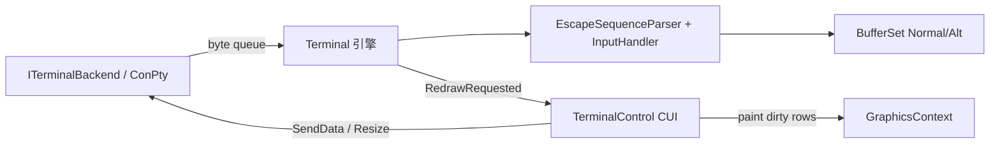

# 按 WPFTerminal 1:1 移植 Terminal

## 范围判定（默认）

对齐对象是 **WPFTerminal 控件库**（`D:\Kong\Server\WPFTerminal`），不是宿主 `Window_Shell`。Showcase 用一页 `TerminalPage` + ConPTY 演示即可。

终端配色保持 **独立 `TerminalTheme`**（与 WPFTerminal Dark/Light 十六进制完全一致），**不并入** CUI `ThemeManager`——ANSI/OSC 调色板是终端语义，与应用 chrome 色板分离。

## 现状差距

| 层 | WPFTerminal | CUI 现有 |
|----|-------------|---------|
| 结构 | Terminal 引擎 + Control 视图 + Backend | 三者揉在 `TerminalControl` |
| Cell | xterm 式 packed `CellData` | 松散 `TerminalCell` + 即时 `D2D1_COLOR_F` |
| Parser | 完整 VT500 状态机 + InputHandler | 简化 `VTParser`（缺大量 CSI/鼠标模式） |
| 渲染 | dirty-row + 选区圆角 + 光标条 | 简易逐字 DrawText |
| UI | Find、覆盖滚动条、缩放、右键、超链接、IME | 基本选区/滚轮 |
| 主题 | Dark `#0C0C0C` + Ansi16 | 未对齐 |

## 目标架构

目录：`CUI/ui/framework/controls/terminal/` 按 WPFTerminal 分层直译；`TerminalControl` 仍为 CUI `Control` 外壳。

## 移植优先级

1. **Buffer + Cell** — CellData / BufferLine / TerminalBuffer / BufferSet（reflow、YDisp、dirty）
2. **VT** — EscapeSequenceParser + InputHandler + UnicodeWidth / CharsetMaps / HyperlinkStore（废弃简化 VTParser）
3. **ConPTY + Terminal 引擎** — 读线程入队、UI flush、Resize
4. **输入/选区** — KeyboardTranslator / MouseReporter / SelectionService
5. **渲染** — TerminalTheme/AnsiColors/TerminalRenderer（精确 Dark RGB、选区几何、光标条）
6. **TerminalControl UI** — Find 栏、滚动条、缩放、右键菜单、IME、8ms 重绘合并
7. **Showcase + vcxproj** — TerminalPage、ClCompile/ClInclude 清单

## 验收

- cmd/pwsh 可交互；ANSI/TrueColor/SGR 正确
- Alt screen（vim/less）正常
- 选区复制、粘贴、回看、Find、Ctrl+滚轮缩放
- Dark `#0C0C0C`、Ansi16 与 WPFTerminal 一致
- 获焦光标闪烁

## 明确不做

- Window_Shell 多标签远程壳
- 终端 Ansi 色并入 ThemeManager
