<div align="center">

# 🌟 CUI (Component UI Engine)

**基于 Direct2D 1.1 / Direct3D 11 / DirectComposition 的现代化原生 Windows C++20 Fluent 桌面 UI 框架**

[](https://microsoft.com)
[](https://isocpp.org/)
[](https://docs.microsoft.com/en-us/windows/win32/direct2d/direct2d-portal)
[](https://fluent2.microsoft.design/)
[](LICENSE)

[English](#features-overview) • [中文文档](#项目简介) • [快速开始](#快速开始) • [控件展示](#控件库展示) • [构建指南](#编译与构建)

</div>

---

## 📖 项目简介

**CUI** 是一个专为 Windows 桌面应用程序打造的高性能、轻量级、自绘 GUI 引擎。完全采用 **C++20** 标准构建，采用 **Direct2D / Direct3D 11 / DirectComposition** 硬件加速管线，完美融合 **Windows 11 Fluent Design** 视觉规范（Mica 云母材质、Acrylic 亚克力模糊、平滑微动效与圆角流式布局）。

提供极简声明式 Fluent DSL 链式语法，告别臃肿的 Win32 API 与沉重的第三方依赖，即可轻松编写高颜值、高帧率（60~120+ FPS）、极低资源占用的原生现代桌面应用。

---

## ✨ 核心特性

- ⚡ **极致性能与硬件加速**：基于 Direct2D 1.1 / D3D11 硬件交换链与 DirectComposition 渲染管线，支持脏区增量渲染与图层位图缓存，毫秒级响应与超低 CPU/内存占用。
- 🎨 **Windows 11 Fluent 视觉设计**：内置全套 Fluent 3.0 设计规范，支持 Mica/Acrylic 背景、自适应亮暗主题（Dark/Light Mode）、色彩 Token 系统与平滑微光动效。
- 🛠️ **声明式 Fluent C++ DSL**：直观的声明式树形结构与链式 API，支持流式弹性排版（Flexbox/Grid/Stack/Dock 等）。
- 🧩 **50+ 丰富现代控件库**：涵盖基础输入、高级选择器、集合列表、数据可视化图表、系统级选择器与弹窗。
- 📐 **全 DPI 适配支持**：原生支持 Per-Monitor DPI v2 动态缩放，在高刷屏与 4K 超高清屏下保证矢量级细腻绘制。
- 🌊 **高精度动画与物理反馈**：内置弹簧动画曲线、波纹点击涟漪（Ripple）反馈及可切换的低性能降级模式。
- 📦 **零沉重第三方依赖**：纯净原生 Windows 栈，仅依赖 Direct2D/DWrite/D3D11/DXGI 基础系统库。

---

## 🖼️ 控件库展示 (Gallery Showcase)

CUI 提供了全套工业级自绘控件，以下为 `CUI.Gallery` 控件演示应用中的部分经典组件展示：

### 1. 基础按钮与交互组件 (Buttons & Toggles)

| 主要按钮与自定义主题 (Button) | 下拉菜单按钮 (DropDownButton) |
| :---: | :---: |
| 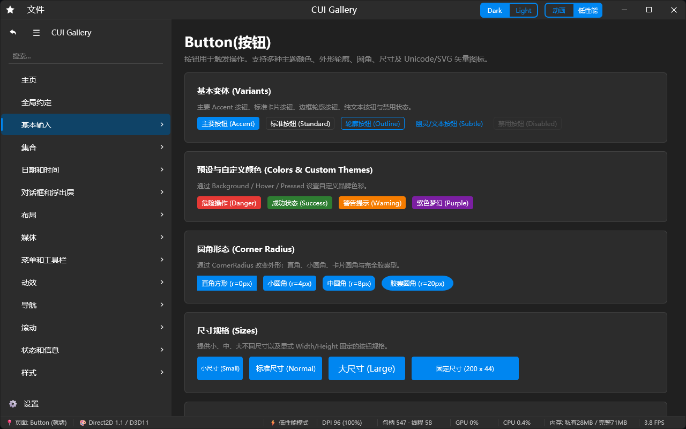 | 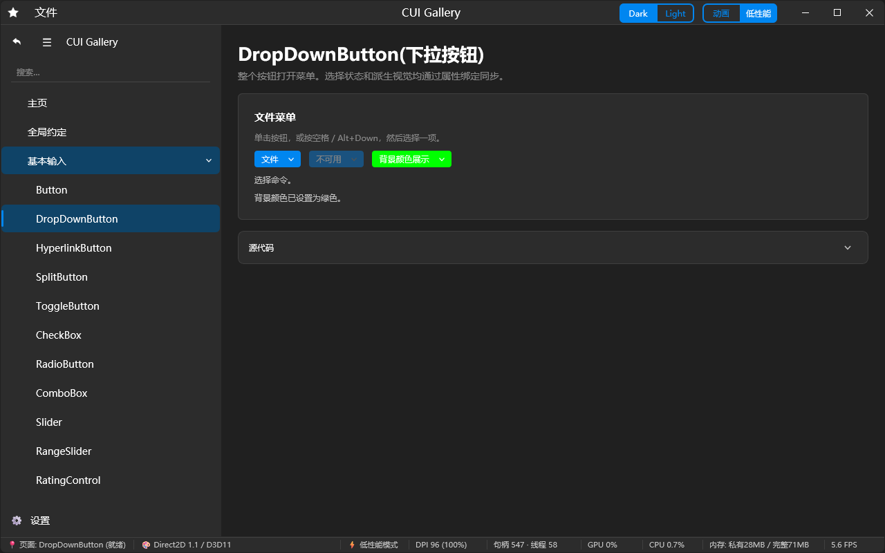 |

| 分裂按钮 (SplitButton) | 开关切换按钮 (ToggleButton) |
| :---: | :---: |
| 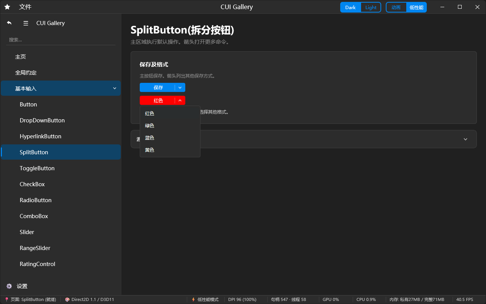 | 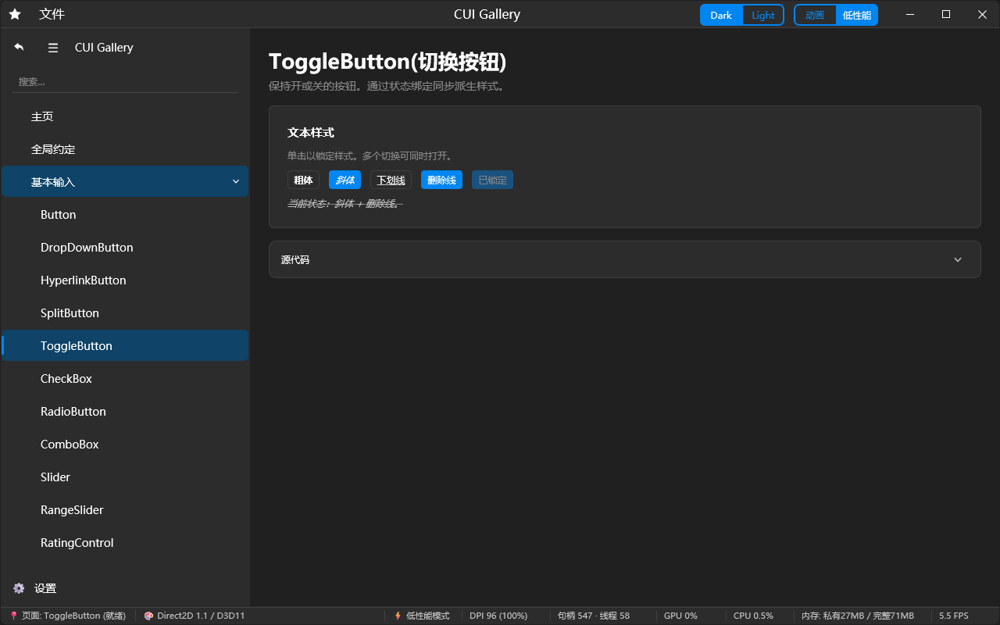 |

| 超链接按钮 (HyperlinkButton) | 复选框 (CheckBox) |
| :---: | :---: |
| 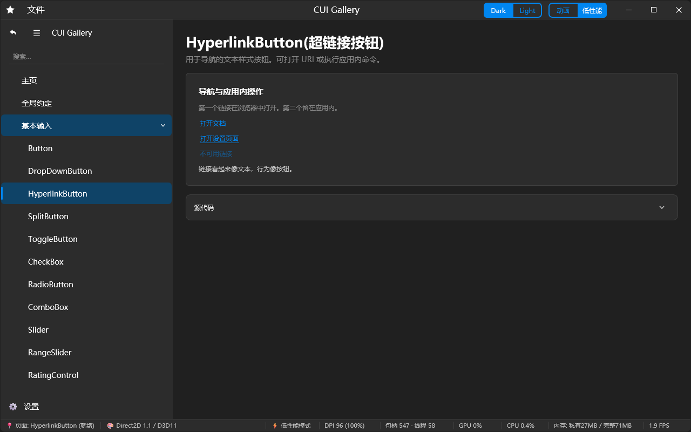 | 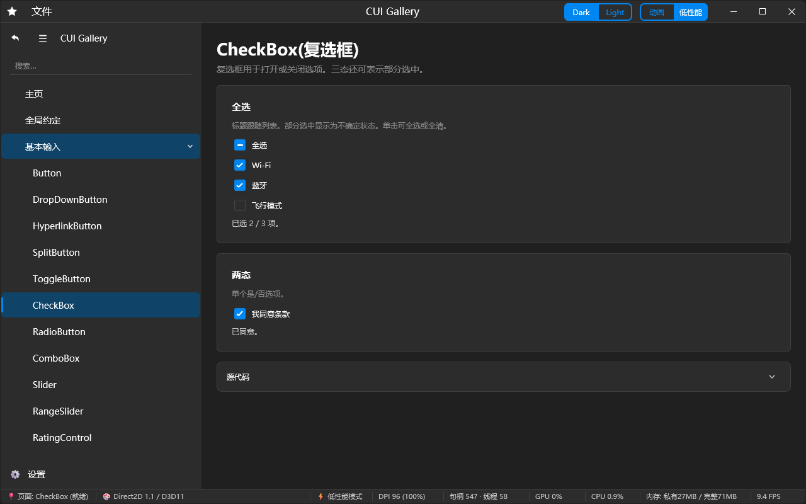 |

---

### 2. 选择器与范围调节组件 (Pickers & Sliders)

| 单选按钮组 (RadioButton) | 下拉组合框 (ComboBox) |
| :---: | :---: |
| 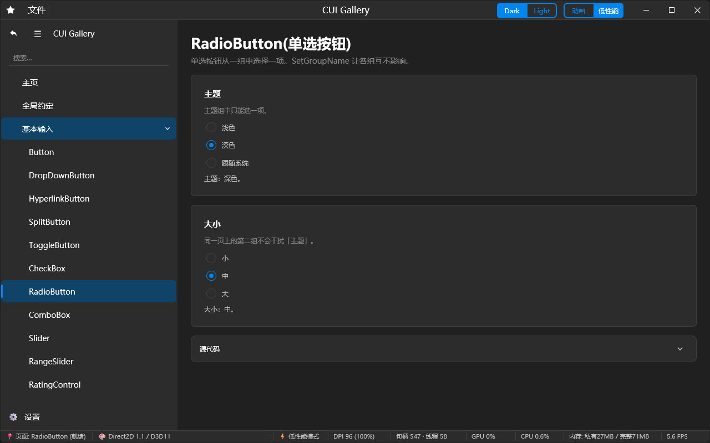 | 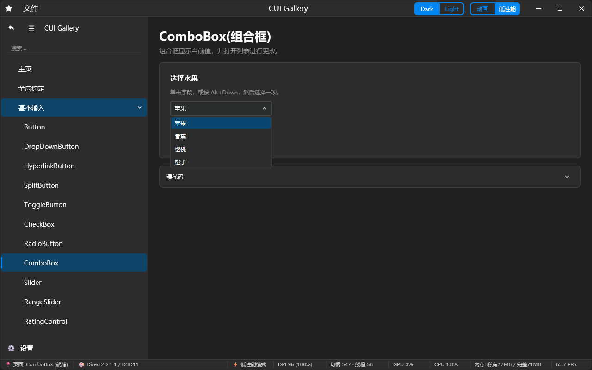 |

| 滑动条 (Slider) | 双向范围滑动条 (RangeSlider) |
| :---: | :---: |
| 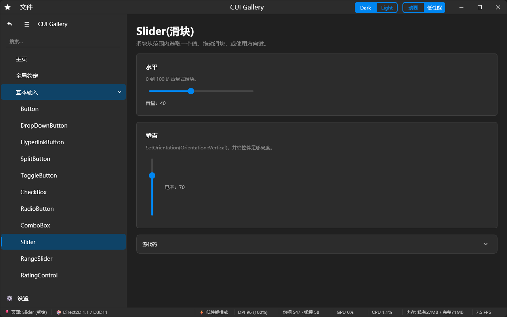 | 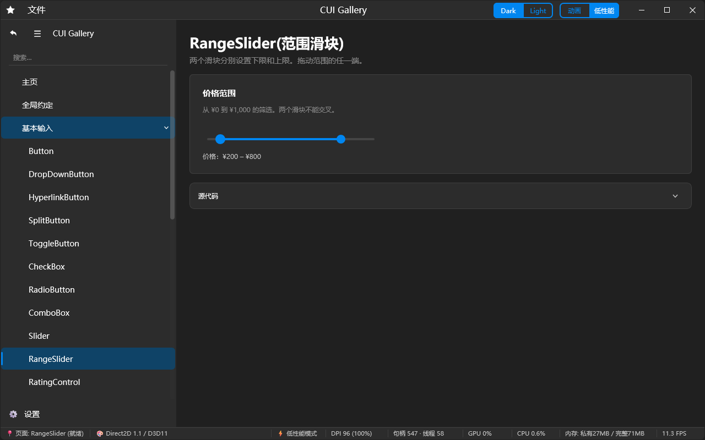 |

| 星级评分控件 (RatingControl) | 底部实时性能状态栏 (StatusBar) |
| :---: | :---: |
| 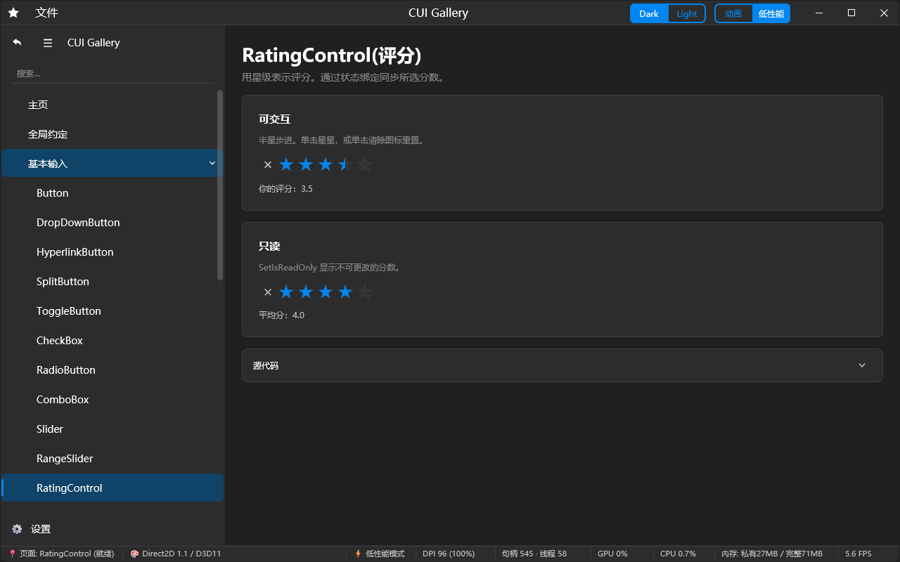 | 实时刷新内存、CPU、GPU、FPS 与渲染后端指标 |

---

## 🚀 快速开始

### 最小可运行示例 (Hello World)

使用 CUI 创建一个现代化 Fluent 窗口只需几行 C++ 代码：

```cpp
#include "framework/window/Window.h"
#include "framework/core/CUIDsl.h"
#include "framework/controls/Button.h"
#include "framework/controls/TextBlock.h"

using namespace CUI;
using namespace CUI::DSL;
using CUI::DSL::Fluent::Button;

int WINAPI wWinMain(HINSTANCE, HINSTANCE, PWSTR, int) {
    CUI::Window window;
    if (window.Create("CUI 现代化应用程序", 800, 600)) {
        auto statusLabel = Text("欢迎使用 CUI Fluent UI 框架！").FontSize(16.0f);

        auto root = Column(16, {
            statusLabel,
            Button("主要操作 (Accent)")
                .OnClick([statusLabel](UIElement*) {
                    statusLabel->SetText("🎉 按钮已点击！");
                }),
            Button("自定义颜色按钮")
                .Background("#E53935")
                .Hover("#D32F2F")
                .Pressed("#B71C1C")
                .Foreground(Color::White)
                .CornerRadius(8.0f)
        })
        .Padding(24)
        .Align(Alignment::Center);

        window.SetRootElement(root);
        window.Show();
        window.RunMessageLoop();
    }
    return 0;
}
```

---

## 🧱 控件家族概览

<details>
<summary><b>点击展开完整控件列表 (50+ 组件)</b></summary>

- **基础输入 (Basic Input)**
  - `Button` (标准 / Accent / 轮廓 / 幽灵 / 自定义色 / 图标)
  - `DropDownButton` (下拉浮动菜单按钮)
  - `SplitButton` (主操作 + 分割下拉动作按钮)
  - `ToggleButton` (状态切换按钮)
  - `HyperlinkButton` (超链接导航按钮)
  - `CheckBox` (复选框，支持三态及平滑选中动画)
  - `RadioButton` (单选框与分组互斥)
  - `ComboBox` (下拉组合选择框)
  - `Slider` (单点数值滑动条)
  - `RangeSlider` (双向区间范围滑动条)
  - `RatingControl` (高精度星级评分组件)
  - `ToggleSwitch` (流畅胶囊滑动开关)
  - `ColorPicker` (专业色彩取色器，支持 HSV/RGB 与预设调色板)
  - `SegmentedControl` (分段选择控制器)

- **文本与排版 (Text & Typography)**
  - `TextBlock` (多行富文本、字距/行高微调、文字截断)
  - `TextBox` (单行/多行文本编辑框、带占位符与清空按钮)
  - `PasswordBox` (密码安全输入框，支持明密文切换)
  - `NumberBox` (数值步进器输入框)
  - `AutoSuggestBox` (搜索联想建议输入框)
  - `MarkdownView` (原生自绘 Markdown 富文本展示引擎)

- **容器与布局 (Layout & Panels)**
  - `StackPanel` / `Row` / `Column` (流式线性排列与 Flex 权重伸缩)
  - `Grid` (表格化行列坐标排版，支持 `*` 比例与 `Auto` 尺寸)
  - `WrapPanel` (自适应折行流式面板)
  - `DockPanel` (四向停靠容器)
  - `UniformGrid` (等分均等网格面板)
  - `Canvas` (绝对像素坐标与 Z-Index 排版)
  - `ScrollViewer` (平滑滚动视图，支持自适应悬浮滚动条)
  - `Expander` (可折叠抽屉容器)
  - `Splitter` (可拖拽尺寸分割条)
  - `DockManager` (工业级停靠停放分屏管理引擎)

- **集合与列表 (Collections)**
  - `ListView` (高性能虚拟化数据列表)
  - `ListBox` (选项列表框，支持单选/多选)
  - `TreeView` (多级树状结构折叠列表)
  - `PagingControl` (分页导航控制器)

- **弹窗与对话框 (Dialogs & Overlays)**
  - `ContentDialog` (模态确认/提示对话框)
  - `Flyout` (锚定浮动气泡浮窗)
  - `TeachingTip` (新手引导教学提示气泡)
  - `ContextMenu` (自绘右键上下文菜单)
  - `ToastCenter` / `Toast` (轻量非阻塞角标通知消息)

- **状态与指示 (Status & Info)**
  - `StatusBar` / `GalleryStatusBar` (底部信息状态栏，支持左右区段与实时性能采样)
  - `ProgressBar` (确定/不确定状态动态进度条)
  - `ProgressRing` (Fluent 旋转加载环)
  - `InfoBar` (行内警告/通知横幅)
  - `ToolTip` (悬停提示信息气泡)
  - `LogView` (高吞吐实时彩色日志输出流控件)

- **多媒体与图表 (Media & Data Visualization)**
  - `LineChart` (实时多线折线图)
  - `BarChart` (分类柱状统计图)
  - `PieChart` (环形/饼状比例分布图)
  - `TopologyView` (拓扑节点与关系连线视图)
  - `TerminalControl` (内置自绘终端模拟器)
  - `Image` (位图与 SVG 矢量图渲染器)

- **窗口与系统 (Windowing & System)**
  - `WindowTitleBar` (原生自绘标题栏，集成菜单栏、窗口缩放与暗黑模式切换)
  - `Backdrop` (DWM Mica / Acrylic 材质窗口背景)
  - `FilePicker` / `FolderPicker` (文件与文件夹选取控件)
  - `DragDrop` (跨应用原生拖拽与数据放置服务)

</details>

---

## 🛠️ 项目工程结构

```text
CUI/
├── CUI.Core/               # CUI 核心引擎静态库 (Direct2D 渲染、排版、样式与基础控件)
│   └── ui/
│       └── framework/
│           ├── animation/  # 动效引擎、时间轴与插值器
│           ├── controls/   # 50+ 完整 Fluent 控件实现
│           ├── core/       # 基础类型、DSL 建造者与属性桥接
│           ├── layout/     # Stack / Grid / Dock / Wrap 排版算法
│           ├── render/     # Direct2D 1.1 / D3D11 / DComp 图形上下文与图层
│           ├── style/      # ThemeManager、暗黑模式与色彩 Token 系统
│           └── window/     # Win32 原生消息泵、DPI 管理与窗口封装
├── CUI.Gallery/            # 官方 Fluent 控件全功能展示画廊 (推荐体验)
├── CUI/                    # VS Code 风格开发者交互演示应用
├── Calc/                   # Fluent 风格现代化计算器实战示例
├── RegeditPlus/            # 现代化 Windows 注册表编辑器实战示例
├── EverythingNEO/          # 毫秒级极速文件搜索工具实战示例
├── Demo/                   # 极简空白入门工程
└── image/                  # 官方说明文档与控件渲染预览图
```

---

## ⚙️ 编译与构建

### 运行环境要求

- **操作系统**：Windows 10 (Version 1809 及以上) 或 Windows 11
- **开发工具**：Visual Studio 2022 / 2025 (安装 `C++ 桌面开发` 工作负载)
- **语言标准**：C++20 (`/std:c++20`)
- **字符编码**：UTF-8 (`/utf-8`)

### 使用 MSBuild 或 Visual Studio 编译

1. **克隆仓库**：
   ```bash
   git clone https://github.com/your-username/CUI.git
   cd CUI
   ```

2. **Visual Studio 打开工程**：
   - 双击打开 `CUI.slnx` 或 `CUI.sln`。
   - 解决方案平台选择 **x64**，配置选择 **Debug** 或 **Release**。
   - 将 `CUI.Gallery` 设为启动项目，按 `F5` 即可编译运行。

3. **命令行极速构建**：
   ```powershell
   # 编译 CUI.Gallery (Debug x64)
   msbuild CUI.Gallery\CUI.Gallery.vcxproj /p:Configuration=Debug /p:Platform=x64 /m

   # 编译 CUI.Gallery (Release x64)
   msbuild CUI.Gallery\CUI.Gallery.vcxproj /p:Configuration=Release /p:Platform=x64 /m
   ```

编译生成的二进制执行程序将输出在 `x64\Debug\` 或 `x64\Release\` 目录下。

---

## 📄 开源许可证

本项目基于 [MIT License](LICENSE) 开源协议，欢迎自由使用、分发、贡献代码与提出 Issue/PR！

---

<div align="center">
Made with ❤️ by CUI Team
</div>
